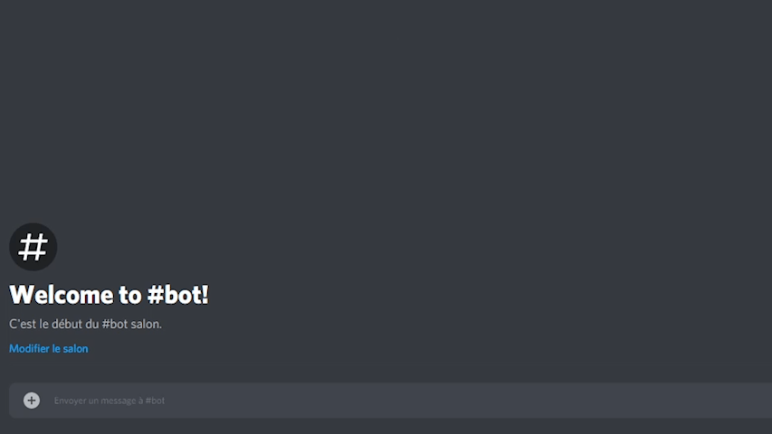

# Epic-bot
Discord bot for my server. You can configure the bot with the `?config` command or go on the [website](https://discord.quozul.dev).

If you wish to invite the bot, [here's an invite link](https://discord.com/oauth2/authorize?client_id=660424710021971988&scope=bot&permissions=8) (the bot is running in English but can be changed to any languages that are in the `lang` folder).

Feel free to open an issue or a pull request to request new features.  

My Discord: `Quozul#1174`.

## Installation
* Clone the repository.
* Run `npm i` to install dependencies.
* Rename `config.template.json` to `config.json` and replace the placeholder values.
* Run the script from the `db.sql` file into you MySQL database.
* Use `npm run bot` to start the bot and `npm run website` to start the website.
* (Optionnal) Create a `epic-logging` channel for the bot to log stuff.

## To do
* Automatically attribute active role(s)
* Config in database per guilds
    * Toggle features/events
    * Change required permission per commands (admin/everyone/disabled)
* Translate command desciption and usage
* Website to configure the bot
* ~~Display the reason for a member's departure~~ not possible
* Custom welcome and leave message
* Music playlist
* Controls music using reactions on message
    *  Next, previous, pause, play and stop
* More websites for musics
* Self-roles assignation using reactions
* Special perks for active guilds
    * Changing the bot's activity
* Images in polls and announcements
* Warn users

## Features
* Welcome and quit message
* Boost progress bar on guild's boost
* Record deleted messages into `epic-logging` channel
* Anti vulgarity filter **[Powered by Bodyguard](https://developers.bodyguard.ai/)** (French only)
* Command cooldown 
* Edit commands 
* Count messages sent by users
* Spam protection
* Weird replies when mentionned **[Using FrenchSentencesGenerator](https://github.com/Klemek/FrenchSentencesGenerator)** (French only)
* Bot configuration through commands and web interface (available at https://discord.quozul.dev/)
* Custom commands/aliases configurable on the website (WIP)

## Commands
* Get list of commands `?help`
* Get random post from reddit `?reddit`
* Get random meme from /r/meme sub-reddit `?meme`
* Lock and unlock voice channels `?lock`, `?unlock` (voice channels automatically unlocks when channel is empty)
* Make the bot speak `?say`
* See a podium of most active users `?podium`
* See boost progress bar `?boost`
* See informations about a user `?whois`
* Play YouTube video in voice channel `?yt`
* Leave the voice channel `?leave`
* Split users into teams `?teams`

#### Admin commands
* Create polls *admin* `?poll`
* Create announcement *admin* `?announcement`
* Clear messages *admin* `?clear`
* Change bot's config for your guild *admin* `?config`

## Config parameters
Name | Description | Default value | Per guild
--- | --- | --- | ---
`token` | The token of your Discord application | none | No
`prefix` | Prefix used for commands | `?` | Yes
`command_cooldown` | Cooldown between sames messages and commands | `5` | Yes
`spam_protection` | Toggles spam protection | `true` | Yes
`lang` | Sets the language of the bot | `english` | Yes
`replies` | Send replies when mentionned (French only) | `true` | Yes
`activity` | |
`activity.type` | The type of the activity, can be `PLAYING`, `WATCHING`, `LISTENING` or `STREAMING` | `STREAMING` | No
`activity.url` | Only if `activity.type` is set to `STREAMING` | `https://www.twitch.tv/quozul` | No
`activity.value` | The "game" the bot is playing | `Utilisez ?help pour connaître la liste des commandes` | No
`bodyguard` | Toggles bad words censorship (French only) | `false` | Yes
`bodyguard_token` | Your Bodyguard token | none | No
`mysql` | |
`mysql.host` | The ip address where your database is hosted | `localhost` | No
`mysql.user` | Username used to connect to your database | `root` | No
`mysql.password` | Password used to connect to your database | `root` | No
`mysql.database` | The name of the database used by the bot | `epic-bot` | No
`website` | | | No
`website.client_id` | ID of the application | | No
`website.client_secret` | Secret token of the application | | No
`website.oauth_url` | URL to redirect the user to Discord's log in page | | No
`website.redirect_uri` | This is used by the server to get the token | `https://localhost:8082/auth` | No